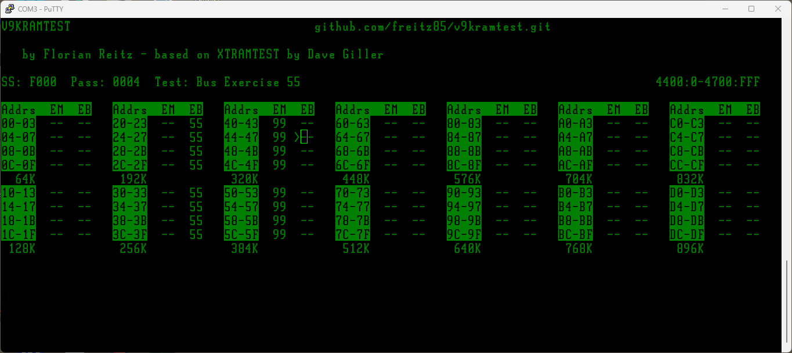
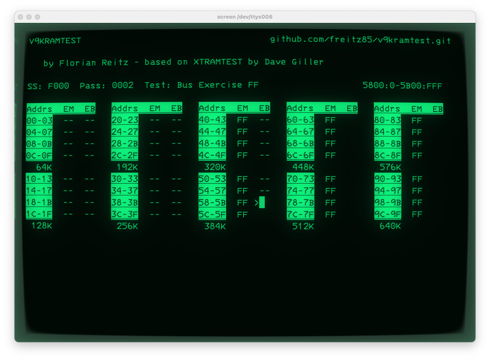

# RAM test ROM for Victor 9000 / ACT Sirius 1  
  
## IGM tweaks:  
- Now tests up to 896K (needs serial terminal with 112 cols)  
- Only needs 4K / the FF ROM (if using 2732 jumpers) 

  

---  

by Florian Reitz based on XTRAMTEST by David Giller

See original project on [GitHub](https://github.com/ki3v/xtramtest)

This is a diagnostic ROM for testing RAM in a Victor 9000 or ACT Sirius 1 computer. It is used by temporarily replacing the BIOS ROM in your machine with this code programmed onto an EPROM chip, which will boot directly into the RAM testing program without requiring functioning RAM or file storage. It does require a serial connection (19200 Baudd, 8N1 on Port A) and a VT100 compatible terminal or terminal emulator (e.g. xterm). Video output is not used as this requires the use of both video RAM and normal RAM due to the V9k's architecture. However, v9kramtest first tests and then uses video RAM as stackspace, allowing testing of every byte of conventional RAM in your system.

The ROM currently performs two types of RAM test:

- The [March-U](https://www.researchgate.net/publication/3349024_March_U_A_test_for_unlinked_memory_faults) algorithm, which is a carefully arranged sequence of sequential reads and writes across the whole memory space looking for faults that result in memory corruption, even where reads/writes to one location cause corruption somewhere else in memory.  This is a common kind of RAM fault that is difficult to detect using simpler testing algorithms.

- Bit pattern and address/data bus exercise testing based on ideas published by [Jack Ganssle](https://www.ganssle.com/testingram.htm).  While just reading and writing bit patterns (the traditional `AA`, `55`, etc. values used by older RAM tests) are of limited value because of the many kinds of RAM faults they don't reliably detect, Ganssle describes in the link above how to aggressively exercise the address and data busses to attempt to expose hardware that may work under simple testing but will fail under heavier load or more challenging sequences of events.

## Using this ROM to test RAM in your Victor 9000

The first way of using this ROM is to pull out your system BIOS ROM chip and temporarily replace it with an EPROM programmed with one of our ROM images.

Two images are included in the Releases (see the right side of the GitHub project page): `v9kramtest_FE.bin` and `v9kramtest_FF.bin` are 4K imagees for burning into 2732/2832 or equivalent 32Kbit/4Kbyte E(E)PROMs and `v9kramtest.bin` is an 8K binary image for burning into a 2764/2864 or equivalent 64Kbit/8Kbyte E(E)PROM (need to be used with an appropriate 2364 Adapter).  

The Victor 9000 can accept both by setting Jumpers E1-E12 to the appropriate positions (see schematics).

## Modifying/Building the ROM

Prerequisites for building:

- Gnu Make
- [NASM](https://www.nasm.us)
- Perl (any reasonably modern version).  There are no module dependencies other than what ships with Perl.

Just type `make` to build the ROM.  Both `nasm` and `perl` should be in your `$PATH`.

This ROM is assembled using NASM.  Tested with version NASM version 2.16.03, but any reasonably modern version should work.

As part of the image file preparation, a checksum is calculated, and this is inconvenient to do in a cross-platform way.  Currently this and a couple other housekeeping tasks are accomplished using Perl scripts.  Perl should be installed by default under Linux, Mac, or the Windows WSL Linux environment.

Build instructions will be forthcoming, but look in the `tools` directory for the scripts used to build the binaries and test under MAME emulation.

## Acknowledgements and dedication

- This ROM was made possible by starting with [xtramtest](https://github.com/ki3v/xtramtest), by David Giller and Adrian Black. See the YouTube video on [Adrian's Digital Basement](https://youtube.com/@adriansdigitalbasement) ([direct video link](https://youtu.be/KcrMssDp8Mo?si=5GnlTwxYQo68uhtq))

- The initialization code is from the [Victor 9000 ROM Source](https://github.com/FozzTexx/Victor9000-ROM-source), which should be public domain.

## License

This project is currently licensed under the GNU Public License version 2.  It includes original code copyright (C) Florian Reitz (myself), copyright (C) David Giller and also makes use of code that is, as far as I can tell, released to the public domain.
